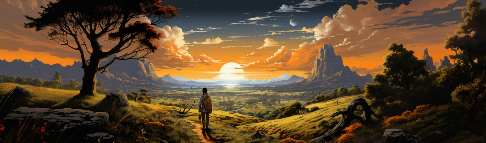
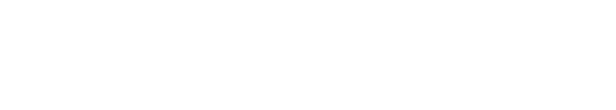

<!-- markdownlint-disable -->

  

  

 
<!-- markdownlint-restore -->

# 🎮 Motomon: A zkVM Autonomous World Game!

Welcome to **Motomon**! The game that brings a modular autonomous world to life with the power of a zkVM built with [Protokit](https://protokit.dev/) and zkOracles.

Step into the world of Motomon, where you can explore, trade, battle, and more, all while experiencing the magic of zero-knowledge.

🚀 Dive deep into an adventure where your every move is secured, verified, and transparent, powered by the state-of-the-art zkVM technology.

## 🌠 Features (Coming Soon)
- Engaging gameplay with zkVM mechanics 🕹️
- Built on top of Protokit's appchain framework 🛠️
- Seamlessly integrated with zkOracles for verifiable game mechanics 🎲
- An ever-growing community of players and contributors 🌍
- Comprehensive game documentation 📖

## 📚 Game Guide & Documentation (Coming Soon)
Delve deeper into the mechanics, features, and details of Motomon:

- [Game Introduction]()
- [How zkVM powers Motomon]()
- [Getting Started Guide]()
- [Trading & Battle Mechanics]()
- [zkOracles and Motomon]()
- [Community & Support]()

## 🤝 Contribute
Motomon thrives with the energy and creativity of our vibrant community. Whether you have ideas for new features, improvements, or just want to contribute to the codebase, we warmly welcome you. Dive into our contributor's guide to get started!

## 📖 License

This project is licensed under the **[Your License Here]**.

See [LICENSE](LICENSE) for more details.

Game on and may the best player win! 🎉 

## Contributors ✨

Thanks goes to all the brilliant minds behind Motomon! ([emoji key](https://allcontributors.org/docs/en/emoji-key)):
<!-- ALL-CONTRIBUTORS-LIST:START - Do not remove or modify this section -->
<!-- prettier-ignore-start -->
<!-- markdownlint-disable -->
<table>
  <tbody>
    <!-- Add your contributors here -->
    <!-- Example format:
    <tr>
      <td align="center" valign="top" width="14.28%"><a href="https://github.com/teddyjfpender"> <b>Contributor Name</b></a> <a href="https://github.com/teddyjfpender/motomon/commits?author=teddyjfpender" title="Code">💻</a></td>
    </tr>
    -->
  </tbody>
</table>

<!-- markdownlint-restore -->
<!-- prettier-ignore-end -->

<!-- ALL-CONTRIBUTORS-LIST:END -->
